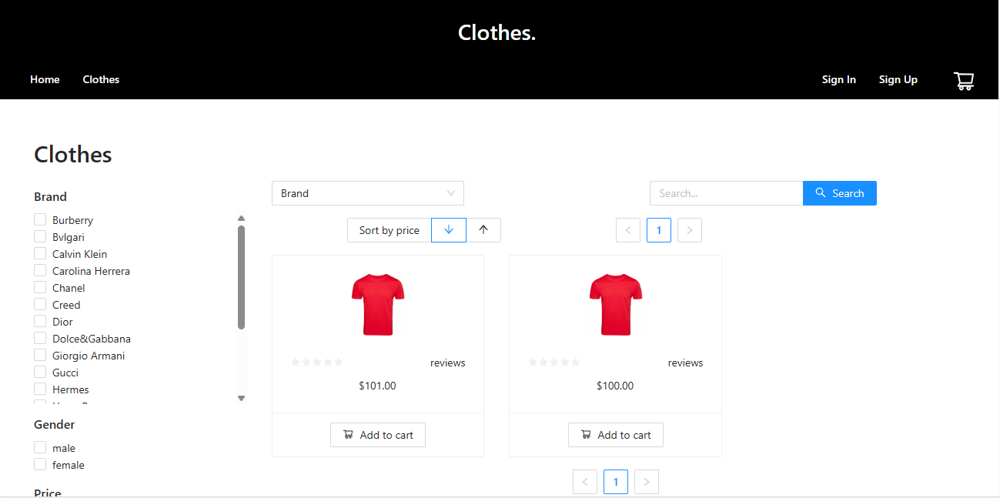
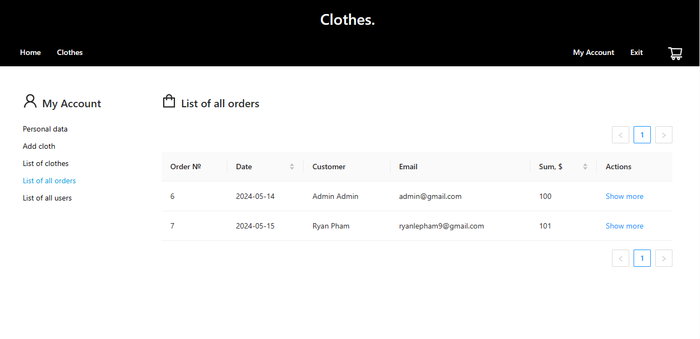

# Clothing Store
<a name="readme-top"></a>
<!-- PROJECT LOGO -->
<br />
<div align="center">

<h3 align="center">Full Stack Clothing Store</h3>

  <p align="center">
    A full stack ecommerce application using React for the frontend, Spring Boot Java for the backend, PostgreSQL as the database, and GraphQL for queries. The application includes user login, registration, authentication, and captcha verification along with admin controls.
  </p>
</div>


<!-- TABLE OF CONTENTS -->
<details>
  <summary>Table of Contents</summary>
  <ol>
    <li>
      <a href="#about-the-project">About The Project</a>
      <ul>
        <li><a href="#built-with">Built With</a></li>
      </ul>
    </li>
    <li><a href="#roadmap">Roadmap</a></li>
    <li><a href="#instructions">Instructions</a></li>
    <li><a href="#demo">Video Demo</a></li>
    <li><a href="#screencaps">Screencaps</a></li>
    <li><a href="#notes">Notes</a></li>
  </ol>
</details>


<!-- ABOUT THE PROJECT -->
## About The Project


The project focuses on creating a full stack ecommerce application that showcases a clothing store. The backend is built with Spring Boot Java, interfacing with a PostgreSQL database, and using GraphQL for queries. The frontend is developed with React, providing a dynamic and responsive user interface. The application includes full user authentication with login and registration features, as well as captcha verification to enhance security. It also features admin controls to manage items, orders and users.


<p align="right">(<a href="#readme-top">back to top</a>)</p>


### Built With

* [![Java][Java.java]][Java-url]
* [![SpringBoot][SpringBoot]][Spring-url]
* [![Maven][Maven]][Maven-url]
* [![PostgreSQL][PostgreSQL]][PostgreSQL-url]
* [![GraphQL][GraphQL]][GraphQL-url]
* [![React][React]][React-url]
* [![Docker][Docker]][Docker-url]

### Tested With

* [![Postman][Postman]][Postman-url]


<p align="right">(<a href="#readme-top">back to top</a>)</p>

<!-- ROADMAP -->
## Roadmap

- ✔️ Implement user authentication with JWT
- ✔️ Add captcha verification for user registration and login
- ✔️ Develop a dynamic frontend using React
- ✔️ Build a robust backend with Spring Boot and PostgreSQL
- ✔️ Integrate GraphQL for efficient data querying
- ✔️ Implement shopping cart and order processing functionalities
- ✔️ Develop an admin interface for managing products, users and orders
- ✔️ Test endpoints with Postman
- ✔️ Utilize Docker for containerized deployment and easy setup across different environments


<p align="right">(<a href="#readme-top">back to top</a>)</p>


<!-- INSTRUCTIONS -->
## Instructions

- Ensure Docker is installed and running on your system
    - See https://docs.docker.com/ for installation instructions
1) Build the Docker image and ensure no previous cache is used:
    - ```docker-compose build --no-cache```
2) Compose the Docker image:
    - ```docker-compose up```
    
- Manual Installation:
  - Client frontend:
    1) ```npm install```
    2) ```npm start```
  - Server backend:
    1) ```maven clean install```
    2) ```mvn spring-boot:run```
    

- Postgresql database should have credentials (change in application.properties if needed):
    - Username: ```postgres```
    - Password: ```root```

    


<p align="right">(<a href="#readme-top">back to top</a>)</p>


<!-- DEMO -->
## Video Demo

[](https://youtu.be/e9M33RZeYQw)

<p align="right">(<a href="#readme-top">back to top</a>)</p>

<!-- SCREENCAPS -->
## Screencaps






<p align="right">(<a href="#readme-top">back to top</a>)</p>


<!-- NOTES -->
## Notes

- Admin credentials:
  - Admin Login: ```admin@gmail.com```
  - Admin Password: ```admin123```
  

- When an admin upload a new item to the store, it may take up to 30 mins for the store to update. To avoid this, re-run the server backend.
- If you cannot  upload any item images as admin, you must change file permissions of static.asset.images to be able to read, write, execute.


<p align="right">(<a href="#readme-top">back to top</a>)</p>


[Java.java]: https://img.shields.io/badge/java-%23ED8B00.svg?style=for-the-badge&logo=openjdk&logoColor=white
[Java-url]: https://www.java.com/en/
[Maven]: https://img.shields.io/badge/Apache%20Maven-C71A36?style=for-the-badge&logo=Apache%20Maven&logoColor=white
[Maven-url]: https://maven.apache.org/
[SpringBoot]: https://img.shields.io/badge/spring-%236DB33F.svg?style=for-the-badge&logo=spring&logoColor=white
[Spring-url]: https://spring.io/projects/spring-boot
[PostgreSQL]: https://img.shields.io/badge/PostgreSQL-316192?style=for-the-badge&logo=postgresql&logoColor=white
[PostgreSQL-url]: https://www.postgresql.org/
[GraphQL]: https://img.shields.io/badge/GraphQL-E10098?style=for-the-badge&logo=graphql&logoColor=white
[GraphQL-url]: https://graphql.org/
[React]: https://img.shields.io/badge/react-%2320232a.svg?style=for-the-badge&logo=react&logoColor=%2361DAFB
[React-url]: https://reactjs.org/
[Docker]: https://img.shields.io/badge/docker-%230db7ed.svg?style=for-the-badge&logo=docker&logoColor=white
[Docker-url]: https://www.docker.com/
[Postman]: https://img.shields.io/badge/Postman-FF6C37?style=for-the-badge&logo=postman&logoColor=white
[Postman-url]: https://www.postman.com/
[JUnit5]: https://img.shields.io/badge/Junit5-25A162?style=for-the-badge&logo=junit5&logoColor=white
[JUnit5-url]: https://junit.org/junit5/